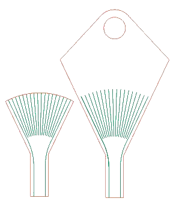

Key Manufacturing Instructions
----------

### Preparing DXFs
* Export top/bottom profiles of the desired key as DXFs from [OnShape](https://cad.onshape.com/documents/81b497ca0101eec8a2f58d9a/w/c1007a546aad69be27f5195b/e/9d9eec69682a24b688784a9d)
* Import top/bottom DXFs to CorelDraw in mm units
* Select each profile and ungroup the lines
* Mark the cut lines as red/green (for cut/groove) as shown below

### Laser Cutting
* Print the CorelDraw file to laser cutter utility
* Set the laser cutter settings as in the table below
* Place a sheet of 1.5mm acrylic on the laser cutter bed
* Position the top/bottom pieces on the sheet
* Laser cut and wait a little for the fumes to evacuate

| Type | Power | Speed | DPI |
| --- | :---: | :---: | :---: |
| Red (cut) | 100 | 12 | 300|
| Green (groove) | 15 | 60 | 500 |

### Conditioning
* Remove the two pieces and clean with napkin (to remove acrylic vapor residue)
* Sand the laser cut side of pieces with fine-grain sand paper
* Clean the grooves of the sanded acrylic with compressed air

### Assembly
* Hold the pieces together and insert the guide fibers (with jacket) on either side of key
* Insert the bare fiber array from the tip of key (in between the guide fibers)
* Ensure that the guide fibers are still in their grooves
* While holding the assembly together, use super glue on either side to attach the top/bottom pieces permanently
* Remove the bare fiber array

### Fiber Insertion
* Cut required number of fibers to more than desired final length
* Remove the jacket of all fibers to the desired length
* Insert the fibers starting from the center grooves of the key, and moving outward symmetrically
* Check fibers for resistance to sliding (all fibers should slide in and out with a moderate and almost equal level of resistance)
* Insert fibers in fully and trim both ends to desired positions

### Conclusion
If something went wrong in the manufacturing process, don't sweat it. It might take a few more iterations. This took me a month to manufacture the first time.

If all went well and the result is as expected, congratulations! You are now a key maker.
